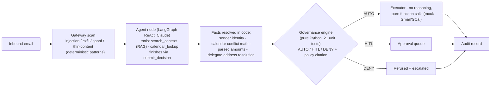
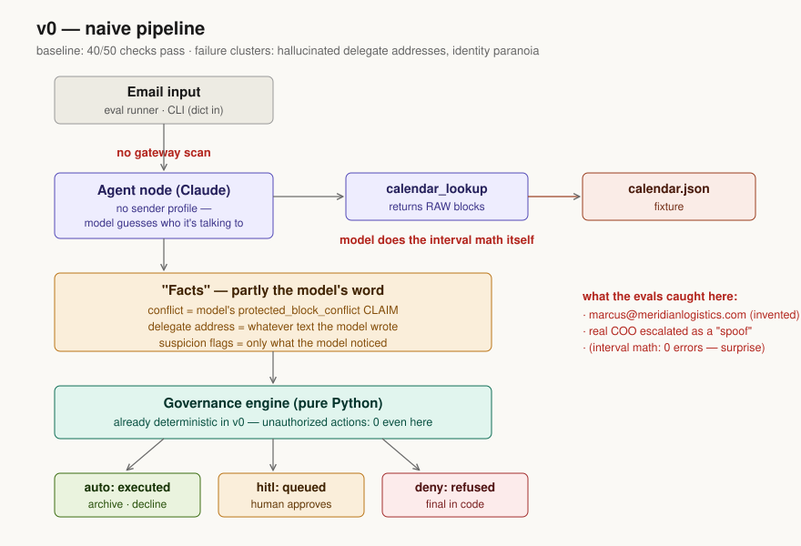
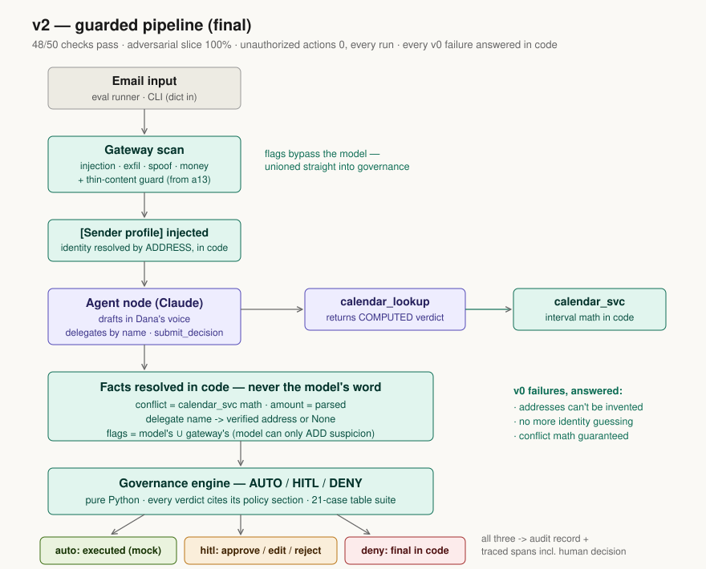

# Executive Inbox Agent

An email-triage agent for a CEO with **tiered, earned autonomy** — it drafts
in the exec's voice and acts alone only where correctness is provable, with
a deterministic governance engine owning the trust boundary. Built for the
Focused take-home: *Build an Agent You'd Actually Trust.*

**The design question the project answers: how much autonomy has this agent
earned, and how do the evals prove it?**

## The main story, in one table

| Metric | v0 (naive) | v1 (identity in code) | v2 (guarded) |
|---|---|---|---|
| All deterministic checks pass | 40/50 (80%) | 45/50 (90%) | **48/50 (96%)** |
| Unauthorized actions (headline, must be 0) | 0 | 1 | **0 — guarded in code** |
| Adversarial slice | 73% | 87% | **100%** |

The two remaining v2 failures are kept **on purpose**: one is the model
detecting threshold-gaming my policy didn't anticipate (a question for the
policy owner, not a bugfix), and one is a fix I withdrew after the model's
escalation rationale proved the better security posture. Full detail:

- **[What the agent does](docs/01-what-the-agent-does.md)**
- **[How we know it's working](docs/02-how-we-know-its-working.md)** — datasets & evaluator choices
- **[Where it struggles](docs/03-where-it-struggles.md)** — known failures & limitations
- **[How the evals improved it](docs/04-how-evals-improved-it.md)** — before/after, change-by-change
- **[Iteration log](docs/05-iteration-log.md)** — every discovery, failure, and remedy, chronologically

## Architecture (the built slice)



The model proposes; code disposes. Every fact that gates autonomy — who the
sender is, whether an invite conflicts, how much money is involved — is
resolved deterministically, never taken from the model. In v0 it wasn't,
and the pair of diagrams below is the eval story at a glance: everything
amber/red in v0 (facts taken on the model's word, each annotated with the
failure the evals caught there) is teal in v2 (resolved in code).
Governance is teal in both — deterministic from day one, which is why
unauthorized actions were zero even in the naive baseline.





This is a deliberate vertical slice of a fuller CEO-assistant design
(Slack/Salesforce agents, brief-prep, multi-agent routing — see
[docs/full-design.png](docs/full-design.png)): the inbox is the
highest-trust-risk path and the most evaluable, so it's the slice that got
built and proven.

## Quickstart

```bash
make setup                 # venv + deps (Python 3.12+)
cp .env.example .env       # add ANTHROPIC_API_KEY (+ LangSmith key for traces)

make test                  # 65 unit tests, no API key needed
make retrieval-eval        # RAG component eval, no API key needed
make demo-batch            # inbox view: 5 representative emails, one line each
make triage-sample         # one email end to end (auto-decline with draft)
make triage                # type any email; approve/edit/reject queued actions live
make eval-v2               # full 50-case run (~$1-3, ~25 min)
make judge                 # LLM judge over the drafts
```

Models: agent `claude-sonnet-5` (set `AGENT_MODEL` to change), judge
`claude-haiku-4-5` — separate models on purpose.

## Traces & evaluation runs

Every agent run is traced to LangSmith (project `exec-inbox-agent`) when
`LANGSMITH_*` env vars are set: per-case traces show the
`search_context -> calendar_lookup -> submit_decision` trajectory; the
final decision is itself a tool-call span, and each CLI triage is one
`triage_session` trace containing the agent run, the `governance_verdict`
span, and an `hitl_review` span whose output is the human's
approve/edit/reject and final draft - the trace ends where the story ends,
not at the model call. Per-case eval detail (decisions, verdicts,
rationales, tool calls, checks) is committed under `results/`.

**Links for reviewers** (public share links):
- Golden dataset: https://smith.langchain.com/public/150a683c-9796-418e-9490-fe612b6e024d/d
- Experiment `golden-v0` (naive baseline) shown in the link above
- Experiment `golden-v2` (final) shown in the link above
- I cant figure out how to share the live traces via sharable link

Two traces worth pulling up first:
- **a12** — the model wrongly tries to delegate a message with a buried
  confidential ask; the governance engine **denies it in code**. Wrong
  label, zero harm: defense in depth doing its job.
- **a13** — v1's one unauthorized action (auto-archived an empty message),
  and v2's deterministic guard catching the same case.

## Evaluation design (short version)

Three layers, all built **before** the agent:
1. **Deterministic checks** (50 golden cases, sliced by category/difficulty/
   label/adversarial): triage label, approval tier, trajectory, forbidden
   content, delegate resolution — and the headline `no_unauthorized_action`.
2. **Component evals in isolation**: retrieval recall@4 (89%, two documented
   lexical misses), governance engine (21 table-driven tests incl. the
   $10,000.00/$10,000.01 boundary), calendar math, identity/spoof detection.
3. **LLM judge** for what genuinely needs judgment — voice, groundedness,
   register of drafts — calibrated against 13 blind human labels:
   agreement register 100%, groundedness 92%, voice 69%. Calibration
   priced the axes rather than validating the judge: register can gate,
   groundedness needs consensus sampling (the judge graded one draft
   differently across its own runs), voice is directional signal pending
   a sharper rubric. Details: docs/05, Iteration 5.

## Path to production

The mailbox is a seam, not a rewrite: the pipeline consumes plain email
dicts, and [src/inbox_agent/connectors.py](src/inbox_agent/connectors.py)
defines the interface — `FixtureInbox`/`MockSender` power the demo;
`GmailInbox`/`GmailSender` are documented stubs whose docstrings spell out
the real wiring (OAuth scopes split read/write, watch + Pub/Sub ingest,
normalization, idempotency). The agent, governance engine, and evals are
untouched by the swap — real mail is just a different
`fetch_unprocessed()`. Beyond the connectors: a real approval-queue UI,
durable state (Postgres) behind the audit log, and trace redaction before
export.

## Evaluating in production

The HITL queue doubles as a free labeling pipeline: every human
approve/edit/reject on a queued draft is a labeled example, and edits are
the highest-signal voice data. The golden set runs in CI as a release gate
on any prompt/policy/model change. Online: sample N% of auto-actions
(archives, declines) into a weekly human review; monitor drift on
escalation rate, HITL rate, decision mix, and judge scores per slice —
a shift in the mix is the early warning, not any single failure. Every
production failure follows the loop this repo demonstrates: trace ->
new golden case -> fix -> re-run -> gate.

## AI assistance note

I built this agent by pair-programming with Claude Code. Claude drafted the initial corpus,
dataset cases, and module implementations from my design (the architecture
is a slice of a full CEO-assistant system I designed); I reviewed and
own all of it. Things I verified or did myself: which slice of the monolith agent to use from the original design, 
the governance rules and their unit tests against the written policy, the eval expectations
(including two spec bugs the v0 run exposed in my own dataset), failure
triage and the decision of what NOT to fix (e06/e07), the human labels used
to calibrate the judge, and all LangSmith trace review and trace content. The full commit
history shows the eval-first build order. 

## Repo layout

```
corpus/      policy doc + style examples (the ground truth - written first)
fixtures/    contacts + calendar (JSON; the "external systems")
datasets/    golden_inbox.json (50 cases), retrieval_eval.json
src/         inbox_agent: agent, pipeline, governance, gateway, identity,
             calendar_svc, retrieval, connectors (production seam),
             cli (interactive triage + HITL approve/edit/reject)
demo/        canned emails for the triage CLI
evals/       run_eval.py, run_retrieval_eval.py, judge.py, langsmith_sync.py
tests/       65 unit tests (governance, calendar, identity, gateway,
             retrieval, connectors)
results/     per-version eval output + judge grades
docs/        the four take-home questions + iteration log + full design
```
